# Data-Visualisation
## Overvew
A set of interactive Plotly visualisation for exploring operator scoring data over time. It is built with Python, using the  Pandas and Plotly libraries, each producing answering a different question about the data set.

### Charts
<span style="color: orange;">**Violin**</span>: How do socres compare across operators

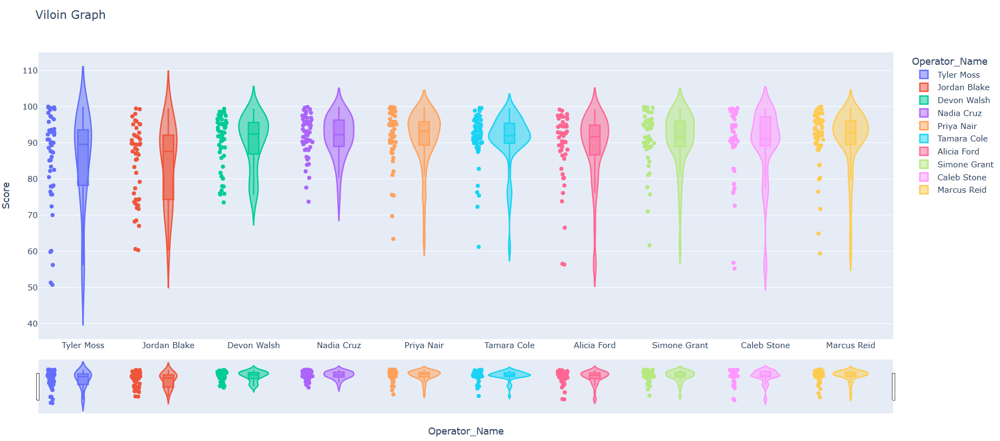

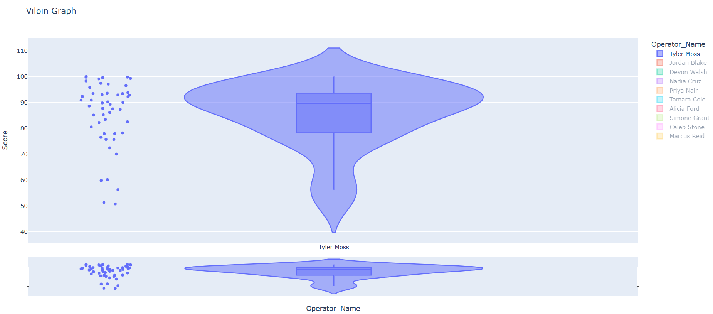
single operator chose for review

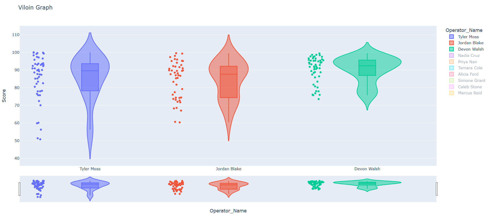
multiple operators chosen for review

---
<span style="color: orange;">Histogram</span>: How are scores distributed

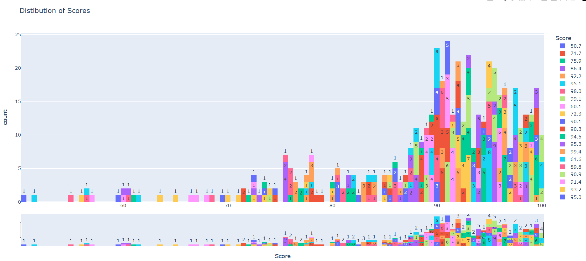
All scores showing a left-skewed distribution

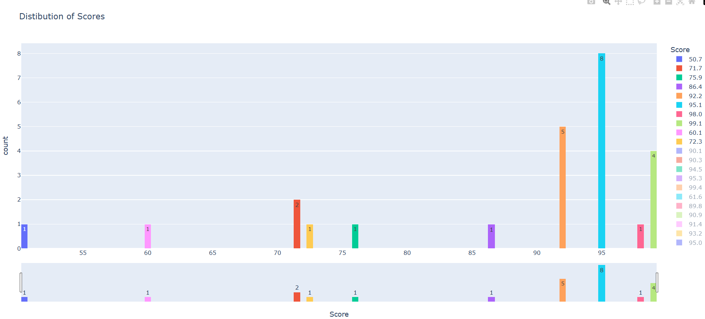
Selecting individual options

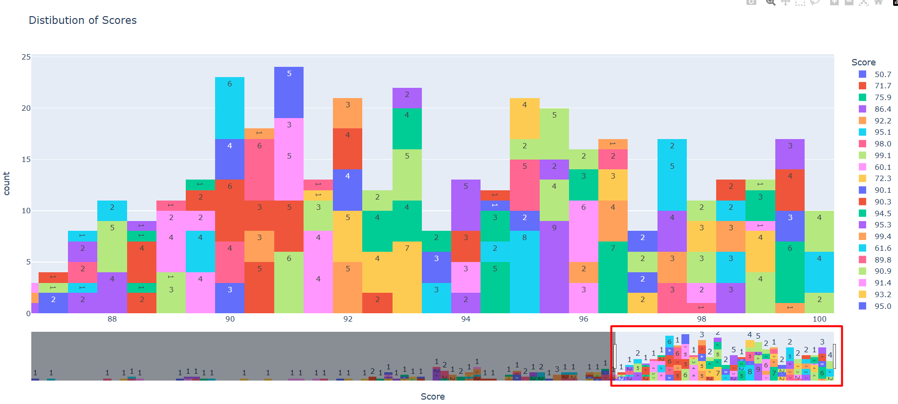
Using the range slider to focus in on specific regions

---
<span style="color: orange;">Line #1 (Scores over time)</span>: What are the trends across a full period (average/maximum/minimum)

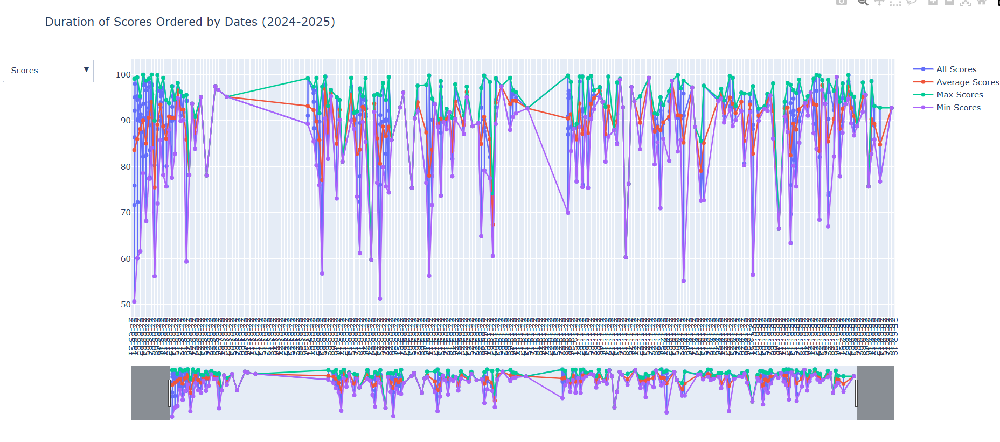
All scores across the date range

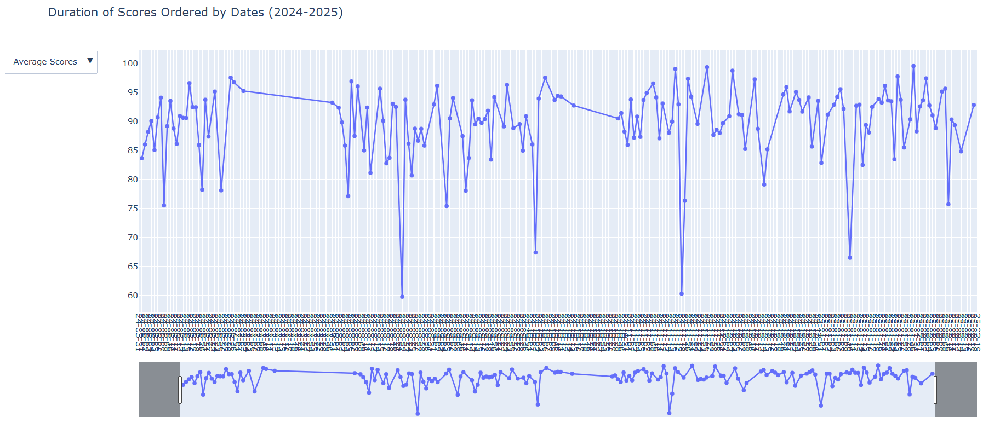
Only showing the average scores

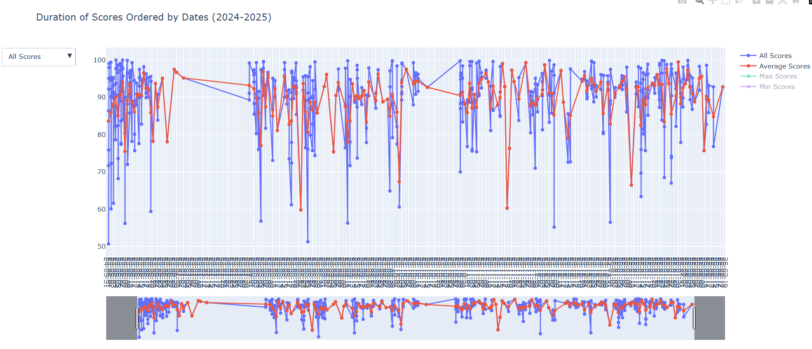
comparing the average score across all scores
---
<span style="color: orange;">Line #2 (Individual Scores)</span>: How did a specific operator perform over time

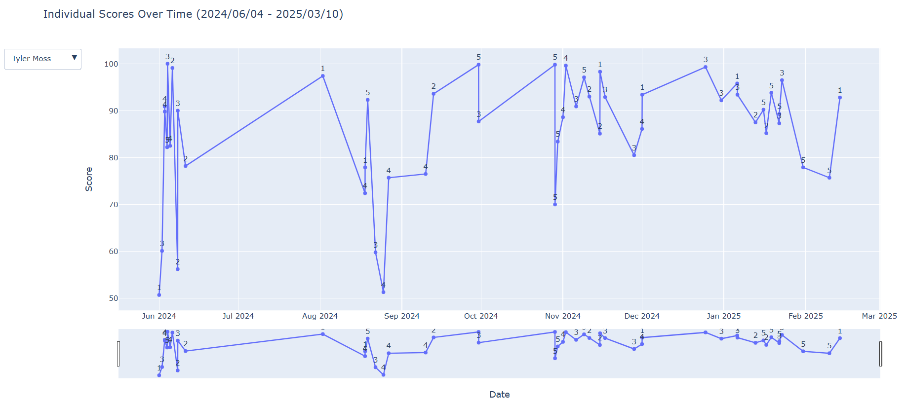

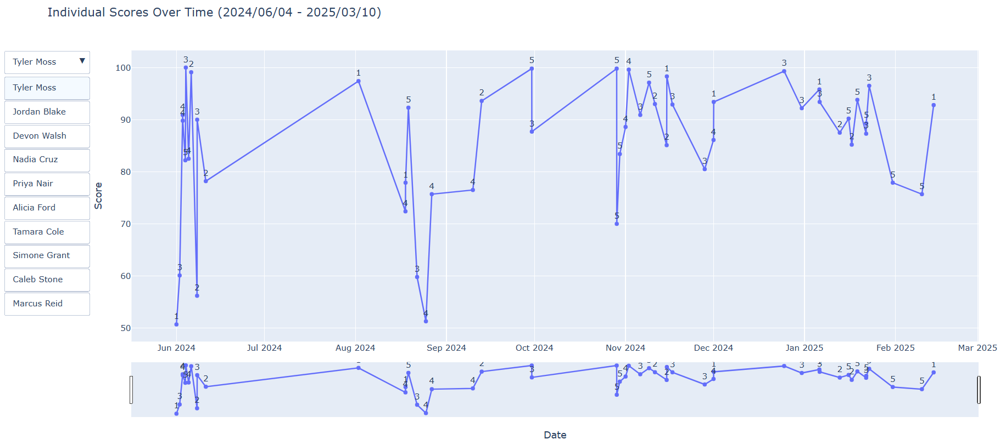
Can select individual operators for review
## Stack
Python
Pandas
Plotly

## Preiew
Pre-generated HTML files are available [here](html-files). Download and open in any browser, no Python required.

## Setup
Run these commands separately

```bash
git clone <repo_name>
pip install -r requirements.txt
cd scrip-files
python <name_of_file>.py
```
